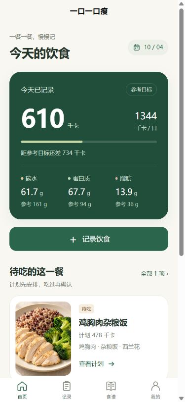
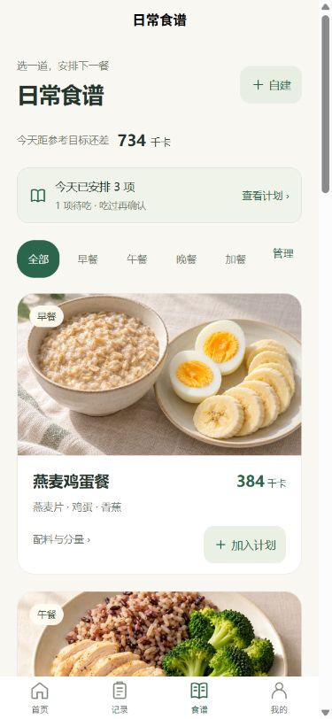
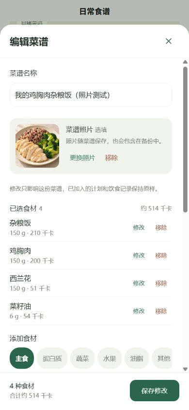
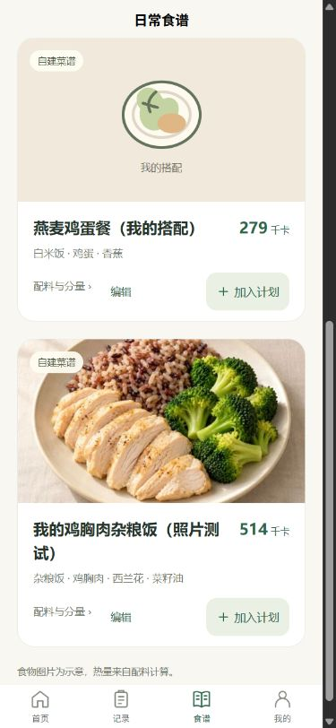

# 一口一口瘦

在现有 uni-app 微信小程序上持续打磨的饮食记录工具，用于记录实际摄入、安排待吃计划和维护自己的食谱。技术栈为 Vue 3、TypeScript、Pinia、本地存储；推荐使用规则计算，没有大模型调用、账号或云同步。

用户确认 GitHub 是优化开始时的最新源码，微信因名称重复申请过名称调整，当前统一使用“一口一口瘦”。本版接续 `179e61a` 之后顾问对话的未提交成果，完成整体视觉、自建食谱编辑与照片、实用默认分量等优化。2026-10-04 用户确认本地效果并授权提交、推送 GitHub；源码同步不代表微信线上版本已更新，本轮没有部署、提审或发布，线上版本与本版源码的对应关系仍未核验。

**[用户需求文档](docs/PRD.md)**：已确认需求、验收标准、数据保护、剩余问题与用户/AI分工。更新日期：2026-10-04。

## 当前功能

- 首页展示实际摄入、已有参考目标和营养信息；未填写身体资料也能记录，没有目标时不虚构百分比，未知营养显示“未完善”。
- 首页“记录饮食”进入今天已吃，首页和食谱可直接进入今天计划；加入食谱后保留成功反馈和下一步入口。
- 记录支持精确克数修改、当天合计变化预览、保存后撤销、批量删除、历史查看和补记；计划热量与实际摄入分开。
- 计划按整道菜展示与操作，配料按需展开；多选/全选、批量记已吃、撤回、移除及撤销。实际摄入仍逐配料保存并显示所属菜名，移除计划不删除已吃记录。
- 食谱使用统一食物照片卡片，保留详情、配料替换、整道加入和管理；自建菜谱保留横向分类与宽敞编辑区。
- 已建菜谱可编辑名称、配料、克数和照片，更新原菜谱；编辑不追溯改变旧计划或摄入记录。照片可添加、更换、移除，缺图有统一默认图。
- 自建选材使用便于编辑的起始量：油5g/步进1g、坚果15g、鸡蛋50g、燕麦40g等，可按实际用量精确修改；不改写既有分量，也不是个体摄入建议。
- 自定义食材按已知克重及千卡/千焦换算，分类建议可调整、营养选填；记录、计划、菜谱共享使用。
- 起始日独立年月日选择，首页天数只显示；每日目标快照及旧数据兼容。
- 本地JSON备份、导入预览、合并或完整恢复、导入前副本及文本备用出口；菜谱照片随备份保存。

## 实际 H5 截图

以下为390px宽的真实H5页面，使用AI填写的独立测试数据，非微信真机截图、非用户真实饮食。首页/食谱与编辑/自建卡片来自不同测试时点，数值不代表同一组数据状态。

| 首页 | 食谱 |
| --- | --- |
|  |  |

| 自建食谱编辑 | 自建食谱卡片 |
| --- | --- |
|  |  |

[截图来源与范围](docs/screenshots/README.md) · [食物与图标素材说明](docs/VISUAL-ASSETS.md)

## 运行

本次核验环境：Node 24.15.0 / npm 11.12.1。

```powershell
npm ci
npm run dev -- --host 127.0.0.1
npm run typecheck
npm test
npm run build
npm run build:mp-weixin
```

默认H5：`http://127.0.0.1:5173`。本轮独立测试使用 `http://127.0.0.1:5188`，启动方式为 `npm run dev -- --host 127.0.0.1 --port 5188 --strictPort`。不同端口的浏览器本地数据独立，切换预览可能看不到原记录。

微信开发者工具导入 `dist/build/mp-weixin`，使用自己的AppID；源码 `src/manifest.json` 中AppID为空。编译产物不随源码提交，需本地构建。

## 数据与素材

主存储键仍为 `journal-v2`，数据版本2。首次读取兼容原当天键与早期按日数据；旧键保留，历史营养小计仅在主动修改记录分量时重算。没有为视觉改版修改食材数据库或营养计算公式，仍先保存成功再更新状态。

菜谱照片使用可选 `photo` 字段，压缩至最长边不超过480px、单张不超过36KiB；全部菜谱照片编码总长限制为512KiB，包括被隐藏的菜谱。照片内容随原有v2/v3备份保存，不依赖微信临时路径或外部图床；无照片旧数据仍可读取。含自定义食材时导出v3，否则v2，两者均可导入。

七张预设食物示意图由内置图像工具生成并接入，720×540 JPEG合计约426KiB。照片不参与热量推断，预设图按配料匹配；缺图使用统一餐盘/分类图。常规图标使用SVG源，微信使用同源PNG。

本地数据不会自动跨设备同步；清缓存或换设备前先把备份保存到应用外。兼容逻辑有回归测试，尚未使用用户真实微信旧数据进行升级验收。

## 验证与限制

2026-10-04最终功能源码已完成：

| 检查 | 结果 |
| --- | --- |
| `npm test` | 7个文件、121项通过，含导航、照片备份、编辑隔离及保存失败回归 |
| `npm run typecheck` | 通过 |
| `npm run build` | H5生产构建通过 |
| `npm run build:mp-weixin` | 微信小程序编译通过 |
| `git diff --check` | 通过 |
| H5实际页面 | 检查390px、320px、1280px；覆盖空状态、长名称、缺图、弹窗、操作反馈与刷新保留 |

H5实际走通选食谱→加入计划→确认已吃→修改分量→摄入更新→撤销→刷新保留，并检查日期、历史及批量管理。自建编辑保持原ID，旧计划保持原克数；照片添加、更换失败、移除、刷新及备份文本导出/文件选择/完整恢复均实际操作。

微信开发者工具和真机**尚未验收**，不能用H5或编译结果代替。微信相册/相机权限、照片方向、键盘、安全区、文件流程和真实旧数据升级仍需检查。H5已触发下载，但未确认文件落盘；文本导出和文件选择恢复已验证。没有照片裁切/旋转编辑器，自建照片目前用于食谱卡片、详情和编辑区。

## 交接与贡献

- [自建食谱编辑、照片与默认克重：最终121项验证及微信验收步骤](ROUND7-RECIPE-EDIT-HANDOFF.md)
- [整体视觉与交互改版：页面变化、顾问成果与H5证据](ROUND6-VISUAL-HANDOFF.md)
- [自定义食材与备份](ROUND5-HANDOFF.md) · [起始日、整道计划、横向分类](ROUND4-HANDOFF.md)
- [第三轮视觉调整](ROUND3-HANDOFF.md) · [计算及数据规则](ROUND2-HANDOFF.md) · [skill来源与适用性](docs/ROUND3-SKILLS.md)

用户负责需求、使用反馈、方案取舍、效果确认及推送决策；AI负责源码核查、设计细化、代码实现、排错、测试和文档。本项目不能描述为用户独立手写开发，也没有用户增长、性能提升比例或真机验收通过的证据。

历史交接中的“未提交/未推送”、测试数量和待办是当时记录，后续变化以需求文档及最新交接为准。完整截图、日志和过程资料在本地相邻 `../visual-2026-10-04/`，仓库仅保存精选截图；原始README归档于 [docs/README-baseline.md](docs/README-baseline.md)，不代表当前验证状态。
